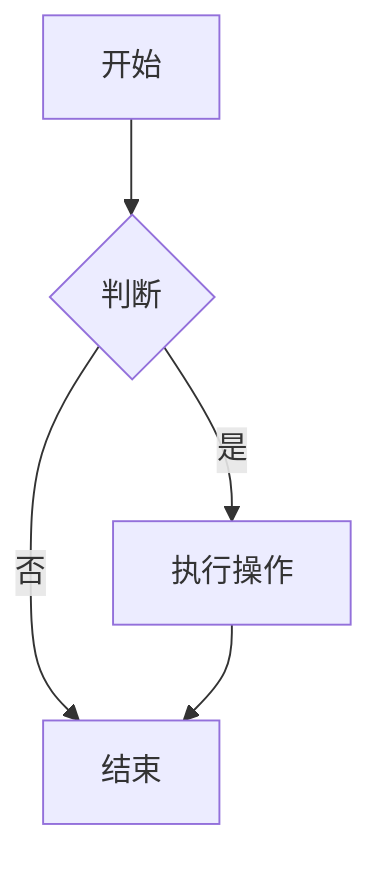
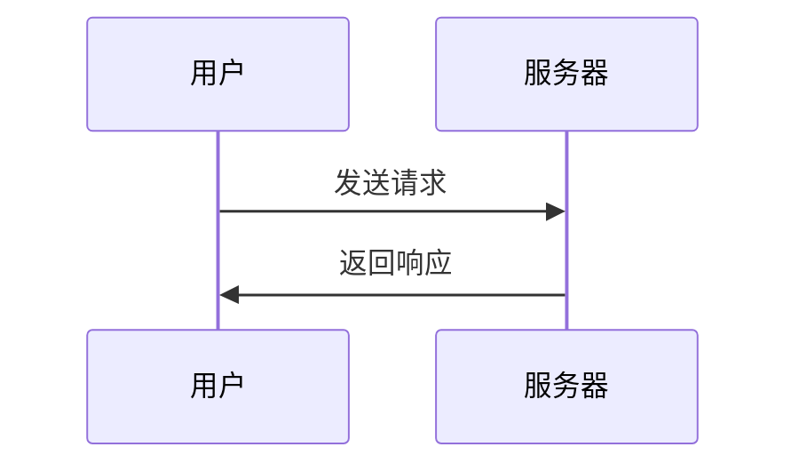

# Markdown 语法完全手册

 [Markdown语法](https://markdown.com.cn "最好的markdown教程")。

## 📖 目录

- [基础语法](#基础语法)
- [高级功能](#高级功能)
- [扩展语法](#扩展语法)
- [实用技巧](#实用技巧)
- [工具推荐](#工具推荐)

## 基础语法

### 标题

```markdown
# 一级标题
## 二级标题
### 三级标题
#### 四级标题
##### 五级标题
###### 六级标题
```

### 段落与换行

```markdown
这是第一段文字。
这是同一段的第二行（会自动合并）。

这是第二段文字（空行分隔）。
  
这是第三段，后面有两个空格  
强制换行到这里。
```

### 文本样式

```markdown
**粗体文本** 或 __粗体文本__

*斜体文本* 或 _斜体文本_

***粗斜体文本*** 或 ___粗斜体文本___

~~删除线文本~~

`行内代码`

==高亮文本== (部分编辑器支持)

上标：X^2^
下标：H~2~O
```

### 列表

#### 无序列表
```markdown
- 项目一
- 项目二
  - 子项目一
  - 子项目二
    - 孙项目一
- 项目三

* 也可以使用星号
+ 或者加号
```

#### 有序列表
```markdown
1. 第一项
2. 第二项
   1. 子项一
   2. 子项二
3. 第三项
```

#### 任务列表
```markdown
- [x] 已完成的任务
- [ ] 未完成的任务
- [ ] 另一个任务
```

### 引用

```markdown
> 这是一个引用块
> 可以跨越多行
>
> > 嵌套引用
> 
> 引用中可以使用 **其他** Markdown 语法
```

### 分割线

```markdown
---

***

___
```

## 高级功能

### 链接

```markdown
[显示文本](https://example.com "可选标题")

[相对路径链接](../folder/file.md)

[引用式链接][1]

[1]: https://example.com "标题"

自动链接：<https://example.com>

邮件链接：<email@example.com>
```

### 图片

```markdown


带尺寸的图片：


图片链接：
[](large.jpg)
```

### 表格

```markdown
| 左对齐 | 居中对齐 | 右对齐 |
|:-------|:--------:|-------:|
| 单元格 | 单元格   | 单元格 |
| 长内容 | 内容     | 内容   |

| 姓名 | 年龄 | 职业 |
|------|------|------|
| 张三 | 25   | 工程师 |
| 李四 | 30   | 设计师 |
```

### 代码块

#### 行内代码
```markdown
使用 `console.log()` 函数输出信息。
```

#### 代码块
````markdown
```javascript
function hello() {
  console.log("Hello, World!");
  return true;
}
```

```python
def fibonacci(n):
    if n <= 1:
        return n
    return fibonacci(n-1) + fibonacci(n-2)
```

```bash
#!/bin/bash
echo "Hello, World!"
```
````

#### 带标题的代码块
````markdown
```js:index.js
// 这是 index.js 文件
console.log("Hello");
```
````

### 脚注

```markdown
这是一个带有脚注的句子[^1]。

另一个脚注[^2]。

[^1]: 这是第一个脚注的内容。
[^2]: 这是第二个脚注的内容，可以包含**格式**。
```

## 扩展语法

### 定义列表

```markdown
术语一
: 定义一

术语二
: 定义二
: 另一个定义
```

### 表情符号

```markdown
:smile: :heart: :+1: :-1:

🚀 ⭐ 🎯 💻 📚

直接使用 Unicode 表情符号
```

### 数学公式

#### 行内公式
```markdown
勾股定理：$a^2 + b^2 = c^2$

爱因斯坦质能方程：$E = mc^2$
```

#### 块级公式
```markdown
$$
\int_{-\infty}^{\infty} e^{-x^2} dx = \sqrt{\pi}
$$

$$
\begin{bmatrix}
a & b \\
c & d
\end{bmatrix}
$$
```

### 图表 (Mermaid)

````markdown



````

### 目录生成

```markdown
[TOC]

<!-- 或者 -->
[[toc]]
```

### 属性设置

```markdown
{#id .class key=value}

这是一个段落 {.red #main}

{width=300 height=200}
```

## HTML 混合使用

### 基本 HTML

```markdown
<div align="center">
  <h1>居中标题</h1>
  <p>这段文字也会居中</p>
</div>

<details>
<summary>点击展开详情</summary>

这里是被隐藏的内容，可以包含 **Markdown** 语法。

- 列表项
- 另一个列表项
</details>
```

### 视频嵌入

```markdown
<video width="640" height="360" controls>
  <source src="video.mp4" type="video/mp4">
  您的浏览器不支持视频播放
</video>

<!-- YouTube 视频 -->
<div style="position: relative; padding-bottom: 56.25%; height: 0;">
  <iframe src="https://www.youtube.com/embed/VIDEO_ID" 
          style="position: absolute; top: 0; left: 0; width: 100%; height: 100%;" 
          frameborder="0" allowfullscreen>
  </iframe>
</div>
```

### 样式和内联 CSS

```markdown
<span style="color: red; font-weight: bold;">红色粗体文字</span>

<div style="background: #f0f0f0; padding: 20px; border-radius: 8px;">
  这是一个带样式的区块
</div>

<style>
.custom-block {
  border-left: 4px solid #42b983;
  padding: 10px 15px;
  background: #f8f9fa;
}
</style>

<div class="custom-block">
  自定义样式区块
</div>
```

## 实用技巧

### 转义字符

```markdown
\*不是斜体\*
\# 不是标题
\[不是链接\]

需要转义的字符：\ ` * _ { } [ ] ( ) # + - . ! | >
```

### 注释

```markdown
<!-- 这是注释，不会显示 -->

[//]: # (这也是注释)

[comment]: <> (这还是注释)
```

### 键盘按键

```markdown
按 <kbd>Ctrl</kbd> + <kbd>C</kbd> 复制

<kbd>Esc</kbd> <kbd>Enter</kbd> <kbd>Space</kbd>
```

### 进度条

```markdown
进度： [==========] 100%
任务： [====------] 40%
```

### 徽章和标签

```markdown


**标签：** `JavaScript` `Vue` `Node.js` `数据库`
```

## 完整示例

### 技术文档示例

````markdown
# API 文档

## 概述

> 本文档描述了用户管理 API 的使用方法。

## 快速开始

### 安装

```bash
npm install api-client
```

### 基本用法

```javascript
import { UserAPI } from 'api-client';

const api = new UserAPI({
  baseURL: 'https://api.example.com',
  token: 'your-token'
});

const user = await api.getUser(123);
```

## API 参考

### 获取用户信息

**端点：** `GET /users/:id`

**参数：**

| 参数 | 类型 | 必需 | 描述 |
|------|------|------|------|
| id | number | ✅ | 用户ID |

**响应：**

```json
{
  "id": 123,
  "name": "张三",
  "email": "zhangsan@example.com"
}
```

## 常见问题

### 认证失败

如果遇到认证错误，请检查：

1. Token 是否有效
2. Token 是否过期
3. 权限设置是否正确

## 更新日志

- **v1.1.0** (2024-01-15)
  - ✅ 新增批量操作接口
  - 🐛 修复分页问题

- **v1.0.0** (2024-01-01)
  - 🎉 初始版本发布

---

*文档最后更新: 2024年1月20日*  
*如有问题，请提交 [Issue](https://github.com/username/repo/issues)*
````

### 博客文章示例

````markdown
# 深入理解 JavaScript 闭包

> 闭包是 JavaScript 中一个重要且常被误解的概念

## 什么是闭包？

闭包是指**函数能够记住并访问其词法作用域**，即使函数在其作用域外执行。

## 代码示例

```javascript
function createCounter() {
  let count = 0;
  
  return function() {
    count++;
    return count;
  };
}

const counter = createCounter();
console.log(counter()); // 1
console.log(counter()); // 2
```

## 应用场景

### 1. 数据私有化

```javascript
function createPerson(name) {
  let age = 0;
  
  return {
    getName: () => name,
    getAge: () => age,
    birthday: () => age++
  };
}

const person = createPerson("张三");
console.log(person.getName()); // "张三"
console.log(person.getAge());  // 0
```

### 2. 函数工厂

```javascript
function createMultiplier(multiplier) {
  return function(x) {
    return x * multiplier;
  };
}

const double = createMultiplier(2);
const triple = createMultiplier(3);

console.log(double(5)); // 10
console.log(triple(5)); // 15
```

## 性能考虑

| 场景 | 建议 | 原因 |
|------|------|------|
| 大量闭包 | 谨慎使用 | 可能内存泄漏 |
| 短期使用 | 推荐 | 提升代码质量 |
| 循环中 | 避免 | 每次迭代创建新闭包 |

## 总结

闭包是 JavaScript 的强大特性，正确使用可以：

- ✅ 实现数据封装
- ✅ 创建高阶函数
- ✅ 编写更模块化的代码

但也要注意：
- ⚠️ 避免不必要的内存占用
- ⚠️ 理解作用域链的影响

---

<div align="center">

**喜欢这篇文章？请给我点个 ⭐**

</div>

> 作者：你的名字  
> 发布日期：2024年1月20日  
> 标签：`JavaScript` `闭包` `前端`
````

## 工具推荐

### 编辑器支持

- **VS Code** - 内置 Markdown 支持 + 扩展
- **Typora** - 专业的 Markdown 编辑器
- **Obsidian** - 知识管理 + Markdown
- **Notion** - 在线笔记，支持 Markdown

### 实用扩展

- **Markdown All in One** - VS Code 扩展
- **Markdown Preview Enhanced** - 预览增强
- **Mermaid 支持** - 图表渲染
- **Markdown Lint** - 语法检查

### 在线工具

- **Markdown Here** - 浏览器扩展
- **StackEdit** - 在线 Markdown 编辑器
- **Dillinger** - 实时预览编辑器

---

## 📚 学习资源

- [Markdown 官方指南](https://www.markdownguide.org/)
- [CommonMark 规范](https://commonmark.org/)
- [GitHub Flavored Markdown](https://github.github.com/gfm/)

---

<div align="center">

**🎉 恭喜！您已经掌握了 Markdown 的完整语法**

*开始用 Markdown 书写您的精彩内容吧！*

</div>

---

*本手册最后更新: {{ now | date('Y年m月d日') }}*  
*📝 持续更新中，欢迎反馈和建议*