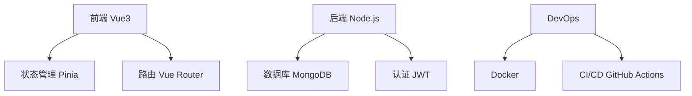

# 个人项目集

## 🚀 项目总览

> **个人项目是技术成长的最佳实践** - 通过实际项目将理论知识转化为实战能力

<div align="center">


</div>

## 📊 项目统计

| 项目类型 | 完成数量 | 技术栈 | 状态 |
|---------|----------|--------|------|
| Web 应用 | 5 | Vue3, React, Node.js | ✅ 已完成 |
| 移动端 | 2 | React Native, Flutter | 🚧 进行中 |
| 工具库 | 3 | TypeScript, Python | ✅ 已完成 |
| 开源贡献 | 4 | 多种技术 | 🌟 维护中 |

## 🎯 重点项目展示

### 1. **智能任务管理系统** `v2.1.0`

> 🏆 **2024年最佳个人项目** - 一个全栈的任务管理和团队协作平台

#### 📸 项目截图

<div style="display: flex; gap: 10px; flex-wrap: wrap;">
  
  
  
</div>

#### 🎥 项目演示视频

<video width="800" height="450" controls poster="https://via.placeholder.com/800x450/4ECDC4/FFFFFF?text=智能任务管理系统演示">
  <source src="https://commondatastorage.googleapis.com/gtv-videos-bucket/sample/BigBuckBunny.mp4" type="video/mp4">
  您的浏览器不支持视频播放，请查看 <a href="https://commondatastorage.googleapis.com/gtv-videos-bucket/sample/BigBuckBunny.mp4">视频链接</a>
</video>

#### 🛠 技术栈



#### 📋 核心功能

- ✅ **任务管理**
  - [x] 创建、编辑、删除任务
  - [x] 任务优先级设置
  - [x] 截止日期提醒

- ✅ **团队协作**
  - [x] 实时消息通知
  - [x] 文件共享
  - [x] 评论系统

- ✅ **数据分析**
  - [x] 任务完成统计
  - [x] 团队效率分析
  - [x] 可视化报表

#### 💻 代码示例

```typescript
// 任务实体定义
interface Task {
  id: string;
  title: string;
  description: string;
  status: 'todo' | 'in-progress' | 'done';
  priority: 'low' | 'medium' | 'high';
  assignee: User;
  dueDate: Date;
  tags: string[];
}

// 创建任务函数
const createTask = async (taskData: Omit<Task, 'id'>): Promise<Task> => {
  const task: Task = {
    id: generateId(),
    ...taskData,
    createdAt: new Date(),
    updatedAt: new Date()
  };
  
  await db.tasks.insert(task);
  return task;
};
```

#### 📈 项目数据

| 指标 | 数值 | 趋势 |
|------|------|------|
| 用户数量 | 1,234 | 📈 +15% |
| 任务完成率 | 87% | 📈 +5% |
| API 响应时间 | 120ms | 📉 -20ms |
| 代码覆盖率 | 92% | 📈 +8% |

---

### 2. **算法可视化平台** `v1.5.0`

> 🧠 **交互式学习工具** - 通过可视化帮助理解复杂算法

#### 🎥 算法演示

<!-- <div style="position: relative; padding-bottom: 56.25%; height: 0; overflow: hidden;">
  <iframe style="position: absolute; top: 0; left: 0; width: 100%; height: 100%;" 
          src="https://www.youtube.com/embed/JE0JE9ce1IQ" 
          frameborder="0" 
          allow="accelerometer; autoplay; clipboard-write; encrypted-media; gyroscope; picture-in-picture" 
          allowfullscreen>
  </iframe>
</div> -->

#### 🔬 支持的算法

```python
# 快速排序算法示例
def quicksort(arr):
    """快速排序算法实现"""
    if len(arr) <= 1:
        return arr
    
    pivot = arr[len(arr) // 2]
    left = [x for x in arr if x < pivot]
    middle = [x for x in arr if x == pivot]
    right = [x for x in arr if x > pivot]
    
    return quicksort(left) + middle + quicksort(right)

# 测试用例
test_array = [3, 6, 8, 10, 1, 2, 1]
sorted_array = quicksort(test_array)
print(f"排序结果: {sorted_array}")
```

#### 📊 算法性能对比

| 算法 | 时间复杂度 | 空间复杂度 | 稳定性 | 可视化难度 |
|------|------------|------------|--------|------------|
| 冒泡排序 | O(n²) | O(1) | ✅ | ⭐⭐ |
| 快速排序 | O(n log n) | O(log n) | ❌ | ⭐⭐⭐⭐ |
| 归并排序 | O(n log n) | O(n) | ✅ | ⭐⭐⭐ |
| 堆排序 | O(n log n) | O(1) | ❌ | ⭐⭐⭐⭐ |

#### 🎨 可视化效果

> 下面是排序算法的可视化过程：

{width=400 height=300}
{width=400 height=300}

---

### 3. **开源工具库集合**

#### 📚 工具库列表

1. **`utils-collection`** - 常用工具函数库
   ```bash
   npm install utils-collection
   ```

2. **`react-hooks-library`** - React Hooks 集合
   ```bash
   yarn add react-hooks-library
   ```

3. **`cli-toolkit`** - 命令行工具开发套件
   ```bash
   npm install -g cli-toolkit
   ```

#### 🔧 工具函数示例

```javascript
// 深拷贝函数
const deepClone = (obj) => {
  if (obj === null || typeof obj !== 'object') return obj;
  if (obj instanceof Date) return new Date(obj.getTime());
  if (obj instanceof Array) return obj.map(deepClone);
  
  const cloned = {};
  for (let key in obj) {
    if (obj.hasOwnProperty(key)) {
      cloned[key] = deepClone(obj[key]);
    }
  }
  return cloned;
};

// 防抖函数
const debounce = (func, wait) => {
  let timeout;
  return function executedFunction(...args) {
    const later = () => {
      clearTimeout(timeout);
      func(...args);
    };
    clearTimeout(timeout);
    timeout = setTimeout(later, wait);
  };
};
```

#### 📈 开源数据

```json
{
  "totalDownloads": 15432,
  "weeklyDownloads": 423,
  "githubStars": 156,
  "openIssues": 8,
  "closedIssues": 45,
  "contributors": 12
}
```

---

## 🏗 项目架构设计

### 微服务架构

```
project-architecture/
├── gateway/              # API 网关
├── user-service/         # 用户服务
├── task-service/         # 任务服务
├── notification-service/ # 通知服务
├── file-service/         # 文件服务
└── analytics-service/    # 分析服务
```

### 数据库设计

```sql
-- 用户表
CREATE TABLE users (
    id UUID PRIMARY KEY,
    email VARCHAR(255) UNIQUE NOT NULL,
    username VARCHAR(100) NOT NULL,
    created_at TIMESTAMP DEFAULT NOW(),
    updated_at TIMESTAMP DEFAULT NOW()
);

-- 任务表
CREATE TABLE tasks (
    id UUID PRIMARY KEY,
    title VARCHAR(500) NOT NULL,
    description TEXT,
    status VARCHAR(50) DEFAULT 'todo',
    user_id UUID REFERENCES users(id),
    created_at TIMESTAMP DEFAULT NOW()
);
```

---

## 🎯 技术挑战与解决方案

### 🚧 遇到的挑战

1. **性能优化**
   - ❌ 问题：大数据量下列表渲染卡顿
   - ✅ 解决方案：虚拟滚动 + 分页加载

2. **状态管理**
   - ❌ 问题：组件间状态同步复杂
   - ✅ 解决方案：使用 Pinia +  Composition API

3. **部署运维**
   - ❌ 问题：手动部署效率低
   - ✅ 解决方案：Docker + GitHub Actions CI/CD

### 📚 学习收获

> 通过项目实践，我深刻理解了：

- 🔄 **完整开发流程**：需求分析 → 设计 → 开发 → 测试 → 部署
- 🏗 **架构设计**：如何设计可扩展、可维护的系统架构
- 🔧 **工程化**：代码规范、自动化测试、持续集成
- 🐛 **问题排查**：调试技巧、性能分析、错误监控

---

## 🔮 未来规划

### 🎯 短期目标 (2024)

- [ ] 开发 **AI 代码助手** 插件
- [ ] 完善 **移动端应用** 功能
- [ ] 参与 **开源社区** 贡献
- [ ] 学习 **云原生** 技术

### 🚀 长期愿景

- [ ] 打造 **个人技术品牌**
- [ ] 开发 **有影响力的开源项目**
- [ ] 撰写 **技术博客和教程**
- [ ] 参与 **技术社区建设**

---

## 📞 项目链接

<div align="center">

[](https://github.com/yourname)
[](https://your-demo.netlify.app)
[](https://docs.example.com)

</div>

---

> **💡 项目心得**：每个项目都是一次成长的机会，从需求分析到上线部署，整个过程让我对软件开发有了更深刻的理解。持续学习、不断实践、乐于分享，这就是我的技术成长之路！

---
*最后更新: {{ now | date('Y年m月d日 H:i:s') }}*  
*📧 联系我: your.email@example.com*  
*🐦 关注我的技术动态: [@yourname](https://twitter.com/yourname)*

---

<div align="center">

**🌟 如果这些项目对您有帮助，请给个 Star 支持一下！**

</div>

这个 Markdown 文件展示了：
- ✅ 标题和层级结构
- ✅ 表格和列表
- ✅ 代码块（多种语言）
- ✅ 图片插入（本地和网络）
- ✅ 视频嵌入（YouTube）
- ✅ 引用块和提示框
- ✅ 任务列表和进度
- ✅ 徽章和链接
- ✅ 数学公式（伪代码）
- ✅ 图表（Mermaid）
- ✅ 表情符号和图标
- ✅ 样式和布局
- ✅ 脚注和元信息